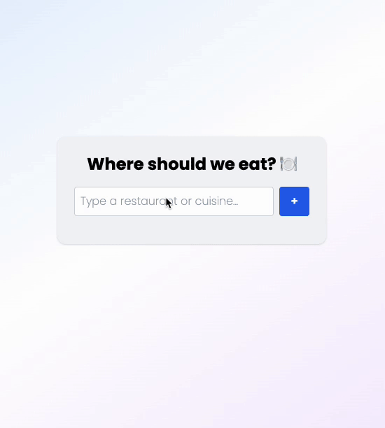

# 🍽️ Where Should We Eat?

An interactive roulette to help decide where to eat — built with React, TailwindCSS, FastAPI, and Redis.

Uma roleta interativa para te ajudar a decidir onde comer — feita com React, TailwindCSS, FastAPI e Redis.

---



---

## 🚀 Tech Stack | Tecnologias

- 🧠 **Frontend**: React + Vite + TailwindCSS
- ⚙️ **Backend**: FastAPI
- ⚡ **Data store**: Redis
- 🐳 **Containerized**: Docker + Docker Compose

---

## 📦 How to Run Locally | Como Rodar Localmente

### 1. Clone the repository | Clone o repositório

```bash
git clone https://github.com/ken-okubo/where-should-we-eat.git
cd where-should-we-eat
```

### 2. Start the app | Inicie a aplicação

```bash
docker-compose up --build
```

Frontend: http://localhost:5173  
Backend API: http://localhost:8001/session/

---

## 🧪 Development | Desenvolvimento

To run the frontend or backend individually:  
Para rodar o frontend ou backend individualmente:

### Frontend

```bash
cd frontend
npm install
npm run dev
```

### Backend

```bash
cd backend
uvicorn main:app --reload --host 0.0.0.0 --port 8001
```

---

## 🎯 Features | Funcionalidades

- Add, delete and list restaurant options.  
  Adicione, remova e liste opções de restaurantes.

- Run a roulette animation to pick one.  
  Rode a roleta animada para sortear um.

- Reset session.  
  Reinicie a sessão.

- All session data is temporary and expires in 1 hour.  
  Todos os dados da sessão são temporários e expiram em 1 hora.

---

## 🤝 Contributing | Contribuindo

Suggestions and improvements are welcome!  
Sugestões e melhorias são bem-vindas!

---

## 🧠 Inspiration | Inspiração

Built for fun and practice — because choosing a restaurant shouldn’t be harder than building software. 😄  
Feito por diversão — porque escolher restaurante não deveria ser mais difícil que programar. 🍜

---

## 👤 Author | Autor

- [Ken Okubo on LinkedIn](https://www.linkedin.com/in/ken-okubo-8b484978/)
- [GitHub Profile](https://github.com/ken-okubo)
